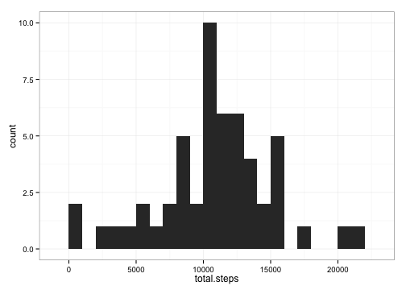
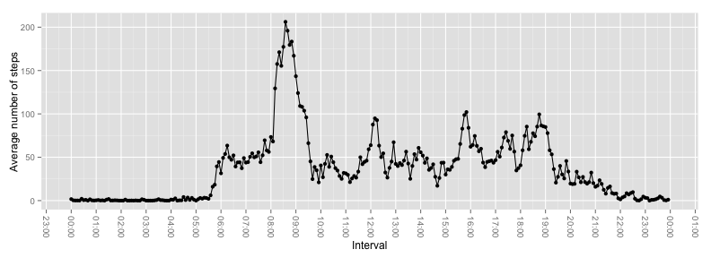
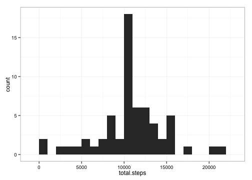
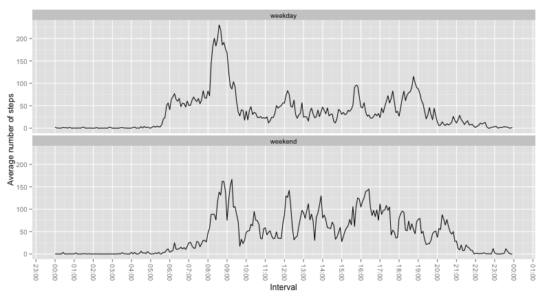

# Reproducible Research: Peer Assessment 1

All document structure and files needed to reproduce this code can be found at this [link][1]

[1]: https://github.com/hanasusak/RepData_PeerAssessment1 "my git hub link"


## Loading and preprocessing the data

To load data following scrip need to be executed (pay attention to comments):

```r
# clean everything at first
rm(list=ls())

# It is assumed that data file  provided for this assigmnet is in current working directory and its name is activity.zip
# Your working directory need to be set to path where data is located.
# (it might be needed to set working directory with function setwd() depending from where you run this code)
unzip(zipfile='activity.zip')

#  read data
data <- read.csv(file='activity.csv')

# header of the data, to get familiar with them
head(data)
```

```
##   steps       date interval
## 1    NA 2012-10-01        0
## 2    NA 2012-10-01        5
## 3    NA 2012-10-01       10
## 4    NA 2012-10-01       15
## 5    NA 2012-10-01       20
## 6    NA 2012-10-01       25
```

```r
# structure of the data, to get familiar with them
str(data)
```

```
## 'data.frame':	17568 obs. of  3 variables:
##  $ steps   : int  NA NA NA NA NA NA NA NA NA NA ...
##  $ date    : Factor w/ 61 levels "2012-10-01","2012-10-02",..: 1 1 1 1 1 1 1 1 1 1 ...
##  $ interval: int  0 5 10 15 20 25 30 35 40 45 ...
```

We would prefer date column to be of type date then factore.

```r
data$date <- as.Date(data$date )
str(data)
```

```
## 'data.frame':	17568 obs. of  3 variables:
##  $ steps   : int  NA NA NA NA NA NA NA NA NA NA ...
##  $ date    : Date, format: "2012-10-01" "2012-10-01" ...
##  $ interval: int  0 5 10 15 20 25 30 35 40 45 ...
```

I also added time column which will combine interval and date together and give me unique indentifier for time intervals:

```r
data$time <- strptime(paste(data$date, sapply(data$interval, formatC, width = 4, flag = 0)), format = "%Y-%m-%d %H%M")
head(data)
```

```
##   steps       date interval                time
## 1    NA 2012-10-01        0 2012-10-01 00:00:00
## 2    NA 2012-10-01        5 2012-10-01 00:05:00
## 3    NA 2012-10-01       10 2012-10-01 00:10:00
## 4    NA 2012-10-01       15 2012-10-01 00:15:00
## 5    NA 2012-10-01       20 2012-10-01 00:20:00
## 6    NA 2012-10-01       25 2012-10-01 00:25:00
```

And just to get familiar with data (like min, max, na values) we pring summary of it.

```r
summary(data)
```

```
##      steps            date               interval   
##  Min.   :  0.0   Min.   :2012-10-01   Min.   :   0  
##  1st Qu.:  0.0   1st Qu.:2012-10-16   1st Qu.: 589  
##  Median :  0.0   Median :2012-10-31   Median :1178  
##  Mean   : 37.4   Mean   :2012-10-31   Mean   :1178  
##  3rd Qu.: 12.0   3rd Qu.:2012-11-15   3rd Qu.:1766  
##  Max.   :806.0   Max.   :2012-11-30   Max.   :2355  
##  NA's   :2304                                       
##       time                    
##  Min.   :2012-10-01 00:00:00  
##  1st Qu.:2012-10-16 05:58:45  
##  Median :2012-10-31 11:57:30  
##  Mean   :2012-10-31 11:30:49  
##  3rd Qu.:2012-11-15 17:56:15  
##  Max.   :2012-11-30 23:55:00  
## 
```
We can see that  column **steps** has missing values.  
Actually *2304* of them.

## What is mean total number of steps taken per day?
**NOTE:** As instructions says we can ignore NA values, my assumption was to exclude all rows where NA values were present.

```r
data2 <- na.omit(data)
```

My prefered way to plot is using *ggplot2* package.  
If you don't have it installed, you would need to do that first (uncommenting first line).

```r
# install.packages('ggplot2')
library(ggplot2)
```

Also to easier manipulate with dates I used  *scales* package.  

```r
# install.packages('scales')
library(scales)
```

We first need to calculate total number of steps per a day, as they are given in 5 minutes intervals.  
As mentioned before, all rows with NA values in steps column are excluded/ingored.
Following code is doing this:

```r
data.byDay <- aggregate(data2$steps, list(data2$date), sum)
colnames(data.byDay) <- c('date','total.steps')
str(data.byDay)
```

```
## 'data.frame':	53 obs. of  2 variables:
##  $ date       : Date, format: "2012-10-02" "2012-10-03" ...
##  $ total.steps: int  126 11352 12116 13294 15420 11015 12811 9900 10304 17382 ...
```

Now we make a histrogram for total steps per a day with binwidth of 1000:

```r
ggplot(data.byDay, aes(total.steps)) + geom_histogram(binwidth=1000) + theme_bw()
```

 

We can calculate mean and median of total number of steps taken per day:

```r
# mean value
mean.steps.perDay <- mean(data.byDay$total.steps)
options(scipen = 1, digits = 2) 
mean.steps.perDay
```

```
## [1] 10766
```

```r
# median value
median.steps.perDay <- median(data.byDay$total.steps)
median.steps.perDay
```

```
## [1] 10765
```

To conclude, mean number of steps per day is  **10766.19** and medain number of steps per day is **10765**.

## What is the average daily activity pattern?

We first aggregate results to get mean value for each interval in multiple days.   
We can use trick to set different days to same day but keep time intervals (lets take current date, but any other could do).

```r
# copy date, so raw one is still same
data2 <- data
# trick to set all days to current date
data2$interval2 <- strftime(strptime(format(data2$time, "%H:%M"), format="%H:%M", tz="GMT"))

# aggregate by time interval to calculate mean accross all days 
interval.byDay <- aggregate(data2$steps, list(data2$interval2), FUN=mean, na.rm=TRUE)
colnames(interval.byDay) <- c('interval','avg.steps')

# reurn back to date-time type for ploting
interval.byDay$interval <- strptime(interval.byDay$interval, format="%Y-%m-%d %H:%M:%S" ,  tz="GMT") 
str(interval.byDay)
```

```
## 'data.frame':	288 obs. of  2 variables:
##  $ interval : POSIXlt, format: "2014-06-12 00:00:00" "2014-06-12 00:05:00" ...
##  $ avg.steps: num  1.717 0.3396 0.1321 0.1509 0.0755 ...
```

Then we can do time series plot to infer which 5-minute time interval is with most steps:

```r
# plot time series of average spteps in 5 min intervals
ggplot(interval.byDay, aes(x=(interval), y=(avg.steps)))  + geom_line() + geom_point() +
  scale_x_datetime(breaks = date_breaks("1 hour"), labels = date_format("%H:%M")) + xlab("Interval") + ylab("Average number of steps") +
     theme(axis.text.x = element_text(angle = -90, hjust = 0, vjust=0.5)) 
```

 

```r
# find interval with maximum average steps 
max.steps <- which.max(interval.byDay$avg.steps)
max.int.st <- interval.byDay[max.steps,]

# interval with max avg steps
format(max.int.st[1], format="%H:%M" )
```

```
##     interval
## 104    08:35
```

```r
# max avg steps
max.int.st[2]
```

```
##     avg.steps
## 104       206
```

We see that at **08:35** samples from given data set make maximum number of average steps (206.17)

## Imputing missing values
We already mention this problem but here we focus on it

Task 1) Calculate and report the total number of missing values in the dataset (i.e. the total number of rows with NAs).  

```r
# we alreadu saw that only steps column has NA vlaues
num.row.na <- sum(is.na(data$steps))
num.row.na
```

```
## [1] 2304
```
There is 2304 rows wtih NA values.

Task 2) Devise a strategy for filling in all of the missing values in the dataset. The strategy does not need to be sophisticated.   
For example, you could use the mean/median for that day, or the mean for that 5-minute interval, etc.


To impute missing values I decided to use rounded mean number of steps for that 5 minute itnerval, as steps are intiger numbers not real.
To use interval mean number of steps instead of days is justified that pattern across intervals captures more information then mean value of steps in a specific day. Best diffrence can be seen that during night freqency of steps is much less and it would be wrong to infer average daily numeber of steps.  
It is true that in some cases suggested imputation of missing value is wrong (e.g. on rainy days when people probably don't walks so much).

Task 3) Create a new dataset that is equal to the original dataset but with the missing data filled in.

```r
# copy data to new data frame
data2 <- data

# calculate median for each 5 min interval ingoring missing values
interval.median <- aggregate(data2$steps, list(data2$interval), FUN=mean, na.rm=TRUE)
interval.median$x <- round(interval.median$x)
inter.ind <- interval.median$Group.1
interval.median <- interval.median[,2]
names(interval.median) <- inter.ind

# replace missing (NA) values 
data2[is.na(data2$steps), 'steps'] <- interval.median[as.character(data2[is.na(data2$steps), 'interval'])]
summary(data2)
```

```
##      steps          date               interval   
##  Min.   :  0   Min.   :2012-10-01   Min.   :   0  
##  1st Qu.:  0   1st Qu.:2012-10-16   1st Qu.: 589  
##  Median :  0   Median :2012-10-31   Median :1178  
##  Mean   : 37   Mean   :2012-10-31   Mean   :1178  
##  3rd Qu.: 27   3rd Qu.:2012-11-15   3rd Qu.:1766  
##  Max.   :806   Max.   :2012-11-30   Max.   :2355  
##       time                    
##  Min.   :2012-10-01 00:00:00  
##  1st Qu.:2012-10-16 05:58:45  
##  Median :2012-10-31 11:57:30  
##  Mean   :2012-10-31 11:30:49  
##  3rd Qu.:2012-11-15 17:56:15  
##  Max.   :2012-11-30 23:55:00
```

As we see in data2 there is no any more missing values.

Task 4) Make a histogram of the total number of steps taken each day and Calculate and report the **mean** and **median** total number of steps taken per day. Do these values differ from the estimates from the first part of the assignment? What is the impact of imputing missing data on the estimates of the total daily number of steps?

We first need to calculate total number of steps per a day, as they are given in 5 minutes intervals.  
Following code is doing this:

```r
data.byDay <- aggregate(data2$steps, list(data2$date), sum)
colnames(data.byDay) <- c('date','total.steps')
str(data.byDay)
```

```
## 'data.frame':	61 obs. of  2 variables:
##  $ date       : Date, format: "2012-10-01" "2012-10-02" ...
##  $ total.steps: num  10762 126 11352 12116 13294 ...
```

Now we make a histrogram for total steps per a day with binwidth of 1000:

```r
ggplot(data.byDay, aes(total.steps)) + geom_histogram(binwidth=1000) + theme_bw()
```

 

We see that distribution is similar as before imputing missing values, but more narrow.  
This can be easy explained by the strategy used for impute missing values, as we replace them by means.
It is true that is replaced by mean of steps in intervals, but this also captures steps done in a day.

We can calculate mean and median of total number of steps taken per day:

```r
# mean value
mean.steps.perDay <- mean(data.byDay$total.steps)
mean.steps.perDay
```

```
## [1] 10766
```

```r
# median value
median.steps.perDay <- median(data.byDay$total.steps)
median.steps.perDay
```

```
## [1] 10762
```

Mean number of steps per day is  **10765.64** and medain number of steps per day is **10762**.
We see that mean and meadian value did not change much, but this is also due to the metodology chosen to impute missing values.

## Are there differences in activity patterns between weekdays and weekends?
**NOTE:** From now we will keep using data with imputed missing values, therefore dataframe data2 (from now on not changed).  
Task 1) Create a new factor variable in the dataset with two levels – “weekday” and “weekend” indicating whether a given date is a weekday or weekend day.


```r
# add weekday column as described
data2$weekday <- sapply(weekdays(data2$time), function (x) if (x %in% c("Saturday", "Sunday" )) "weekend" else "weekday" )
head(data2)
```

```
##   steps       date interval                time weekday
## 1     2 2012-10-01        0 2012-10-01 00:00:00 weekday
## 2     0 2012-10-01        5 2012-10-01 00:05:00 weekday
## 3     0 2012-10-01       10 2012-10-01 00:10:00 weekday
## 4     0 2012-10-01       15 2012-10-01 00:15:00 weekday
## 5     0 2012-10-01       20 2012-10-01 00:20:00 weekday
## 6     2 2012-10-01       25 2012-10-01 00:25:00 weekday
```
Column *weekday* is added.

Task 2) Make a panel plot containing a time series plot of the 5-minute interval (x-axis) and the average number of steps taken, averaged across all weekday days or weekend days (y-axis). 

Similar as in previos task, we aggregate by interval and weekday together:

```r
# copy data so we dont change data2
data3 <- data2
# trick to set all days to current date
data3$interval2 <- strftime(strptime(format(data3$time, "%H:%M"), format="%H:%M", tz="GMT"))

# aggregate by time interval to calculate mean accross all days 
interval.byDay <- aggregate(data3$steps, list(data3$interval2, data3$weekday), FUN=mean, na.rm=TRUE)
colnames(interval.byDay) <- c('interval','weekday','avg.steps')

# reurn back to date-time type for ploting
interval.byDay$interval <- strptime(interval.byDay$interval, format="%Y-%m-%d %H:%M:%S" ,  tz="GMT") 
str(interval.byDay)
```

```
## 'data.frame':	576 obs. of  3 variables:
##  $ interval : POSIXlt, format: "2014-06-12 00:00:00" "2014-06-12 00:05:00" ...
##  $ weekday  : chr  "weekday" "weekday" "weekday" "weekday" ...
##  $ avg.steps: num  2.2889 0.4 0.1556 0.1778 0.0889 ...
```


Now we have prepared data frame to plot and compare patter of average steps done in intervals during weekend and weekdays:

```r
# plot time series of average spteps in 5 min intervals
ggplot(interval.byDay, aes(x=(interval), y=(avg.steps)))  + geom_line() +  facet_wrap(~ weekday, ncol = 1) +
  scale_x_datetime(breaks = date_breaks("1 hour"), labels = date_format("%H:%M")) + xlab("Interval") +
    ylab("Average number of steps") + theme(axis.text.x = element_text(angle = -90, hjust = 0, vjust=0.5)) 
```

 


We see that peek at **08:35** in weekdays is not observed on weekend.  
It could be that people in general get up latter during weekend, and we can see that average number of steps during weekend is in general shifted for few intervals.
